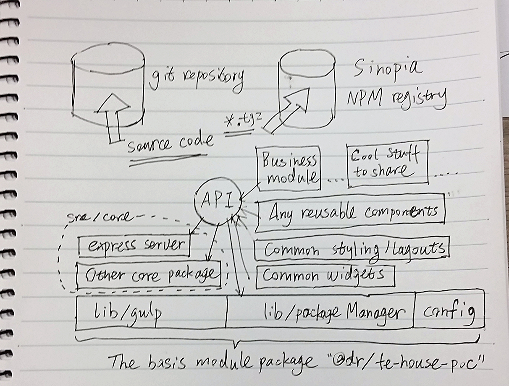
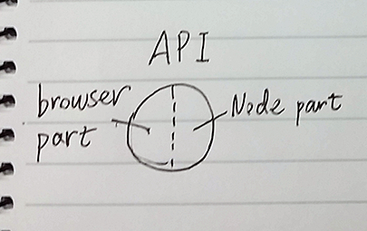

Frontend platform PoC
=====================

Deadline, Jan 23th

Quick Start
-----------

1.	We will need a Sinopia server

```
npm install -g sinopia
```

Start it!

```
sinopia
```

1.	modify your `~/.npmrc` or use command

```
npm set registry http://localhost:4873/
```

Another cool way is to use `nrm` to switch your NPM registry endpoint.

1.	At root folder of this PoC run commands

```
npm install
gulp link
npm start
```

The demo server is started.

Now open browser for URL http://localhost:14333/example-dr/route1 http://localhost:14333/example-dr/route2

If you are able to see a `normal` page, then that means it work.

A Glance at this PoC
--------------------

> Ask LJ for oral explanation, at this moment he really too busy to write down more words in this part

-	**The infrastructure overview** > Everything is NPM package!

 - Every single separated rectangle box in above figure represents an NPM module package. They can be published to *Sinopia* individually.

-	**Packge may contain both browser side stuff and Node side stuff** 

Sometimes, we need browser-side to work with Node-side as a complete feature unit, they should be organized in single package.

-	**API is hybrids too** 

A runtime object. Provides basic functions which helps different packages work together. (e.g. event bus, package lookup tool, universal configuration...)

> Browserify!!!

#### Package types

-	Web framework (express, koa)
-	Reusable JS Service, library, utility
-	UI stuff
	-	AngularJS module
	-	LESS variables, mixins
	-	Common HTML template
-	Entry package (serve an HTML page on specific URL, contains JS, HTML, less files)
-	Examples
-	Your cool stuff

> Package types are just recommendation of package responsibility

e.g.

```
|- lib/
|- node_modules/ ... (3rd-party packages)
|- gulpfile.js
|-	src
	 |- core/
	 |	|- express-server
	 |	|- logger
	 |- UI/
	 |- services/
	 |- util/
	 |- 3rdparty-wrapper/
	 |- examples/
	 |- features/
	 	|- business-feature-A
	 	|- business-feature-B

```

#### External Package

The dependencies sitting in our main package.json, which we get from Sinopia by `npm install`.

External package is the thing shared by another team.

##Testability


