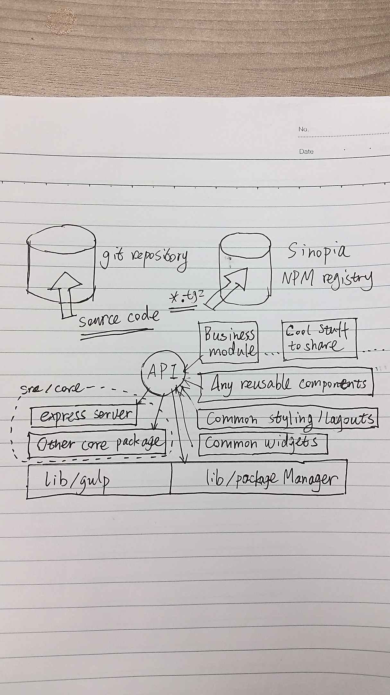

Frontend platform PoC
================
Deadline, Jan 23th

Quick Start
-------------------------

1. We will need a Sinopia server
```
npm install -g sinopia
```
Start it!
```
sinopia
```
2. modify your `~/.npmrc` or use command
```
npm set registry http://localhost:4873/
```
Another cool way is to use `nrm` to switch your NPM registry endpoint.

3. At root folder of this PoC run commands
```
npm install
gulp link
npm start
```
The demo server is started.

Now open browser for URL
http://localhost:14333/example-dr/route1
http://localhost:14333/example-dr/route2

If you are able to see a `normal` page, then that means it work.

A Glance at this PoC
-------------------------
> Ask LJ for oral explanation, at this moment he really too busy to write down more words in this part

- **The infrastructure overview**

	- Every single separated rectangle box in above figure represents an NPM module package. They can be published to *Sinopia* individually.


Concept
----------
### Plateform
The house.

### Package
The furnitures. All packages are *browser side* + *Node side* code hybrids.
- Single responsibility reusable unit
- Business/feature module

#### Package types
- Reusable JS Service, library, utility
- UI package
	* AngularJS module
	* LESS variables, mixins
	* HTML template
- Entry package (serve an HTML page on specific URL, contains JS, HTML, less files)
- ~~Pure *Bower* like package (contains all types of resource like a normal bower package) or NPM module package (e.g. 3rd-party library)~~
- Legacy code wrapper package
- Sample or code snippet

> Package types are just recommendation of package responsibility

e.g.
```
	src
	 |- Services
	 |- UI
	 |- entry
	 |- legacy
	 |- samples

```

#### External Package
TBD


### bundle
business/performance related collection of package, it is matter of compilation and deployment.


What this platform should do
----------
#### It self runs a standalone node server.

#### It scans/watches package folders

#### it serves browser request and routes requests to packages.

#### It provides basic frontend API and backend API
> API is also in the form of packages.

- Browser side Ajax REST API
 > - Pool, sync request bundle
 > - send with proper company security/cache related headers,
 > e.g. referrer

- Node side REST API (a unified interface same as Browser side API)

- Logger
	> e.g. Log4js

- cache/pool API
	> e.g. lru-cache

- Find and list deployed packages.

- Node side DB/DAO API (mongo DB, redis)

- Global event/message handling API (backend events?)
	* package life cycle events
	* business message queue

- Easy/unified package specific setting storage API (e.g. user profile)

- Easy i18n text
> e.g. system scans package files and grabs message keys,
 sends message keys to translation interface, download translated text message to deploy folder.

- Server report
	*

#### It may contain below non-functional capabilities

- be a Node vm container, each packages runs in own vm.
- DB connection Pool
- configurable caching provider(lru-cache)
- static resource bundle
- replace 3rd-party with CDN resource
- server report, health check function (GC status tracking, heap dump, maybe `DataDog` interface, report endpoint URL)
- Maybe Async JS load on entry page
- system API/package permission control
- online package management


Stories of developer
---------
- As internal developer, I can create a internal package without defining `bower.json`
or `package.json` file, my package could be simple like a folder, I can still
reference/call another internal package (Browser JS, LESS, html, Node JS)

- As internal developer, I can create an internal reusable package, which can be shared/
referenced by another internal or external package.

- As developer I can define 3rd-party dependencies through `bower.json`, `package.json` or any new dependency tech for my package.

- As developer I can see my changes in package lively reloaded or refreshed in local dev server.


Continuous integration
----------
TBD.

What this platform should not do
----------
TBD.
