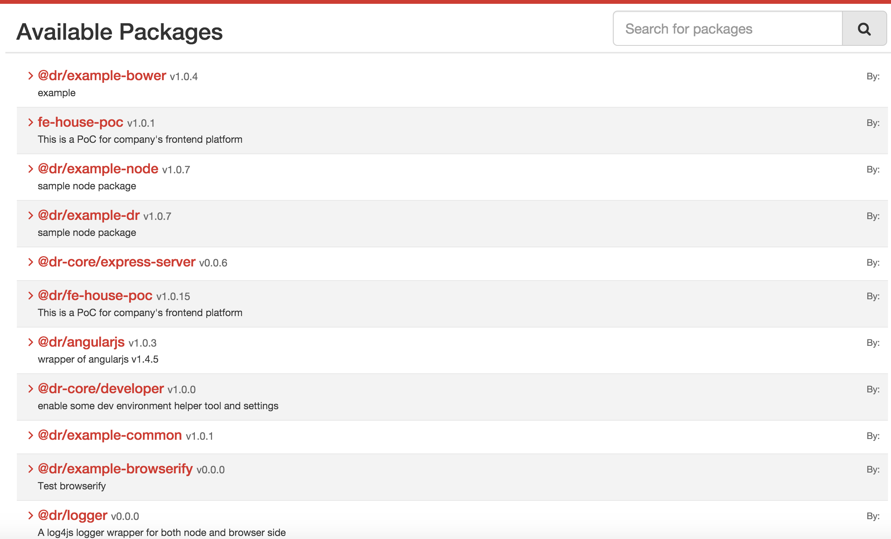
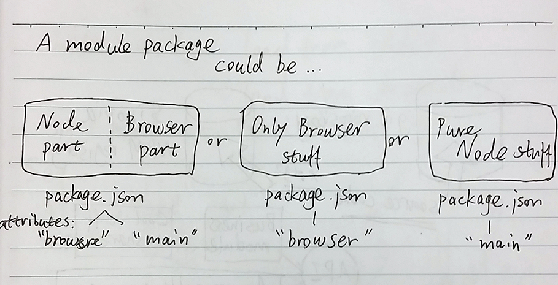

Frontend platform PoC
=====================

Deadline, Jan 23th

Quick Start
-----------

1.	We will need a Sinopia server

	```
	npm install -g sinopia
	```

	Start it!

	```
	sinopia
	```

2.	After download this PoC, go to root folder make sure you can find a hidden file `.npmrc` in there, run command

	```
	npm install --only=dev
	gulp link
	npm install
	gulp browserify
	npm start


	```

	The demo server is started. Now open browser for URL:[http://localhost:14333/example-dr/route1](http://localhost:14333/example-dr/route1)[http://localhost:14333/example-dr/route2](http://localhost:14333/example-dr/route2)

	If you are able to see a "normal" page, that means it worked.

	> You may also manage your profile level npmrc by
	 `npm set registry http://localhost:4873/`
	>
	> Another cool way is to use `nrm` to switch your NPM registry endpoint.

3.	Publish them
	```
	npm set registry http://localhost:4873/
	npm adduser <your user name>
	gulp publish
	```
	Now open you browser and surf to [http://localhost:4873/](http://localhost:4873/).
	
	Check them out, all packages with name prefixed "@dr/" are on Sinopia registry. Now you can create a new empty folder and try


	```
	npm install @dr/fe-house-poc
	cd node_modules/@dr/fe-house-poc
	npm start
	```

	This PoC now is running in another folder!

A Glance at this PoC
--------------------

-	**The infrastructure overview**

> Everything is NPM package!


Every single separated rectangle box in above figure represents an NPM module package. They can be published to *Sinopia* individually.

-	**Packge may contain both browser side stuff and Node side stuff** 

Sometimes, we need browser-side to work with Node-side as a complete feature unit, they should be organized in single package.

-	**API is hybrids too**


A runtime object. Provides basic functions which helps different packages work together. (e.g. event bus, package lookup tool, universal configuration...)

#### What is package

-	Web framework (express, koa)
-	Reusable JS Service, library, utility
-	UI stuff
	-	AngularJS module
	-	LESS variables, mixins
	-	Common HTML template
-	Entry package (serve an HTML page on specific URL, contains JS, HTML, less files)
-	Examples
-	Your cool stuff

> Package types are just recommendation of package responsibility

e.g.

```
├─ lib/
├─ node_modules/ ... (3rd-party packages and external package)
├─ gulpfile.js
├─ .npmrc, .jscsrc .jshintrc...
├─ config.json, config.local.json
├─ ...
└─ src
	 ├─ core/
	 |	├─ express-server
	 |  ├─ redis
	 |  ├─ mongodb
	 |  ├─ logger
	 |	└─ ...
	 ├─ UI/
	 ├─ services/
	 ├─ util/
	 ├─ 3rdparty-wrapper/
	 ├─ examples/
	 └─ features/
	 	├─ business-feature-A
		├─ business-feature-B
	 	└─ ...

```

#### External Package

The dependencies sitting in our main package.json, which we get from *Sinopia* by `npm install`.

External package could be things that owned by another team.

### Dependency

The browser-side code will be packed by Browserify(or Webpack), thus dependency management will be same as node side module, check out *package.json*

```
"dependencies": {
	"lodash": "^4.0.0",
	"log4js": "^0.6.29",
	"q": "^1.4.1",
	"swig": "^1.4.2",
	"@dr/angularjs": "1.0.3",
	"@dr/example-dr": "1.0.6",
	"@dr-core/express-server": "0.0.6",
	"@dr/example-node": "1.0.7"
}
```

Javascript uses `require()` and `module.exports`.

LESS uses `@import`

> Why Browserify? **bundling commonjs server-side**
>
> ... With tooling you can resolve modules to address order-sensitivity and your development and production environments will be much more similar and less fragile. The CJS syntax is nicer and the ecosystem is exploding because of node and npm.
>
> You can seamlessly share code between node and the browser. You just need a build step and some tooling for source maps and auto-rebuilding.

### API is sweet for decoupling stuff

Core packages like express-server, they provide APIs on to API object, e.g.

```
Api.prototype.route()
Api.prototype.templateFolder()
```

Other packages consume APIs.

```
api.route().get('/service', function(req, res) { ... })
```

We can also build explicitly dependency between packages like: PackageA `require('PackageB')`

### Dependency

All private package is named with special *scope*
	e.g. `@dr/example-node`

A private package can also depend on another private package, code in this way,

```
var exampleNode = require('@dr/example-node');
```
Just like how we do it for any 3rd-party public NPM module. And with the power of Browserify (or Webpack), it works in both Node and browser side.


##Test

TBD

[Backlog](doc/backlog.md)
